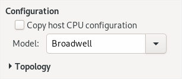

# CPU Vulnerabilities & KVM Security

Eduardo Habkost &lt;ehabkost\@redhat.com&gt; 
 
<a href="https://linuxdev-br.net/">Linux Developer Conference Brazil 2019</a>

Note: Hello, my name is Eduardo.  I work for Red Hat and I'm the
maintainer of the x86 CPU code and a few other subsystems in
QEMU.

Today I'm going to talk about how the new family of CPU
vulnerabilities that started with Spectre and Meltdown in 2018
are affecting KVM, and how we are dealing with this today.

## Contents

* KVM CPU configuration abstractions
* When things fall apart (CPU vulnerabilities)
* New abstractions

Note:
TODO: reorder

I'll start with a walkthrough of the CPU configuration mechanisms
in KVM, QEMU, and libvirt.  Then show how the recent
vulnerabilities break some of the assumptions that exist in
multiple layers of the KVM stack.

Note that I'm not going to described each vulnerability in full
detail, but the focus here is to show how KVM, QEMU, and the rest
of the virtualization stack are affected by them.

# CPU configuration abstractions

Note:
Let's start with the CPU configuration abstractions.

## CPUID

<pre><code class="lang-shell" data-trim data-noescape>
$ x86info -r
eax in: 0x00000000, eax = 00000016 ebx = 756e6547 ecx = 6c65746e edx = 49656e69
eax in: 0x00000001, eax = 000406e3 ebx = 00100800 ecx = 7ffafbff edx = bfebfbff
eax in: 0x00000002, eax = 76036301 ebx = 00f0b5ff ecx = 00000000 edx = 00c30000
eax in: 0x00000003, eax = 00000000 ebx = 00000000 ecx = 00000000 edx = 00000000
eax in: 0x00000004, eax = 1c004121 ebx = 01c0003f ecx = 0000003f edx = 00000000
eax in: 0x00000005, eax = 00000040 ebx = 00000040 ecx = 00000003 edx = 11142120
eax in: 0x00000006, eax = 000027f7 ebx = 00000002 ecx = 00000009 edx = 00000000
eax in: 0x00000007, eax = 00000000 ebx = 00000000 ecx = 00000000 edx = 00000000
<em>[...]</em>
</code></pre>

Note: The starting point for most of what we're to discuss here
is the CPUID instruction in x86.  If you want to
see the raw data returned by the CPUID instruction, you can use
the x86tool.

This is very low level, though.  You are not expected to look at
these numbers and understand what it means.  Normally people look
at a more friendly description...

## CPU flags

<pre><code class="lang-shell" data-trim data-noescape>
$ cat /proc/cpuinfo
vendor_id       : GenuineIntel
cpu family      : 6
model           : 78
model name      : Intel(R) Core(TM) i7-6600U CPU @ 2.60GHz
stepping        : 3
<mark>flags</mark>           : <mark>fpu vme de pse tsc msr pae mce cx8 apic sep mtrr pge mca cmov pat pse36 clflush dts acpi mmx fxsr sse sse2 ss ht tm pbe syscall nx pdpe1gb rdtscp lm constant_tsc art arch_perfmon pebs bts rep_good nopl xtopology nonstop_tsc cpuid aperfmperf tsc_known_freq pni pclmulqdq dtes64 monitor ds_cpl vmx smx est tm2 ssse3 sdbg fma cx16 xtpr pdcm pcid sse4_1 sse4_2 x2apic movbe popcnt tsc_deadline_timer aes xsave avx f16c rdrand lahf_lm abm 3dnowprefetch cpuid_fault epb invpcid_single pti ssbd ibrs ibpb stibp tpr_shadow vnmi flexpriority ept vpid ept_ad fsgsbase tsc_adjust bmi1 hle avx2 smep bmi2 erms invpcid rtm mpx rdseed adx smap clflushopt intel_pt xsaveopt xsavec xgetbv1 xsaves dtherm ida arat pln pts hwp hwp_notify hwp_act_window hwp_epp md_clear flush_l1d</mark>
<em>[...]</em>
</code></pre>

Note: For example, the /proc/cpuinfo file on Linux.
/proc/cpuinfo contains a human-readable description of the CPU.
Most of the information you see there is the CPUID data I've
shown, translated for humans.

I have highlighted the "flags" line, because the most important
CPU features are reported using those flags.  They indicate that
a new instruction, or a new register, or a whole new CPU
functionality is available on the host.

## KVM controls all of the CPUID data seen by the guest

<pre style="width: 32em;"><code class="lang-c" data-noescape>    ioctl(vcpufd, <mark>KVM_SET_CPUID2</mark>, &cpuid_data);</code></pre>

Note: Now, when you are running a virtual machine, the guest will
NOT see the CPUID data of the host CPU directly.  All CPUID data
seen by the guest operating system is controlled by KVM, and is
be configured by userspace (QEMU) using the KVM_SET_CPUID2 ioctl.

## KVM simplest mode: host passthrough

* QEMU:
<pre style="width: 23em;"><code class="lang-shell" data-trim data-noescape>
$ qemu-system-x86_64 <mark>-cpu host</mark> <em>[...]</em>
</code></pre>

* libvirt:
<pre style="width: 23em;"><code class="lang-xml" data-trim data-noescape>
&lt;cpu mode='<mark>host-passthrough</mark>' />
</code></pre>

Guest will see all flags supported by the host <b>hardware and software</b>

Note: ...but you will probably want to let the guest use all the
features supported by your hardware and software.  So, one simple method
for configuring a virtual CPU is called <b>host passthrough</b>.  

Host passthrough mode is enabled using the <b>"-cpu host"</b> option on
QEMU, or the <b>"host-passthrough"</b> mode in the libvirt XML
configuration.

Host passthrough will enable all the features supported by
<b>both</b> the hardware and by KVM.  Why both?  Because most of
the CPU features will only work inside a VM if there's code in
KVM to handle it.

This means host-passthrough mode won't just expose the host CPUID
data to the guest: it will expose only the features that are
really going to work.

However, host-passthrough is not the best solution every time...

## Live Migration

* VMs can be moved to different hosts <b>while running</b>
* OSes don't expect CPUID data to change at runtime
* <!-- .element: class="fragment" --> Can't work with <b>host-passthrough</b>
* <!-- .element: class="fragment" --> Solution: <b>predefined CPU models</b>

Note:
TODO: live migration animation

Because we have a feature in QEMU called <b>live migration</b>.
Live migration means moving a VM to another host <b>while it's
still running</b>.  The other host may have a completely
different CPU, or a different kernel version, or QEMU version, or
libvirt version.

(next) That's why we have a problem: the operating system doesn't
expect CPUID data to change at runtime.  This means
host-passthrough mode can't work with live migration on most cases.

(next) That's why we have predefined CPU models in QEMU.

## CPU models: QEMU

<pre><code class="lang-shell" data-trim data-noescape>
$ qemu-system-x86_64 -cpu help
Available CPUs:
x86 486
x86 Broadwell             Intel Core Processor (Broadwell)
x86 Cascadelake-Server    Intel Xeon Processor (Cascadelake)
x86 Conroe                Intel Celeron_4x0 (Conroe/Merom Class Core 2)
x86 EPYC                  AMD EPYC Processor
x86 Haswell               Intel Core Processor (Haswell)
x86 Icelake-Client        Intel Core Processor (Icelake)
<em>[...]</em>
</code></pre>

Note: this is part of the QEMU help output for the <b>-cpu</b>
option.  There you can see all the predefined CPU models included
in QEMU.

The most basic rule for CPU models is: if your QEMU configuration
is the same, and the CPU model is the same, the guest will see
the same CPUID data.

## CPU models: QMP

<pre><code class="lang-json" data-trim data-noescape>
{ "execute": "query-cpu-definitions", "arguments": {} }
{ ...
  { "name": "Skylake-Client", "<mark>unavailable-features</mark>": [] },
  { "name": "Skylake-Server",
    "<mark>unavailable-features</mark>": [ "avx512f", "avx512dq", "clwb", "avx512cd", "avx512bw",
                              "avx512vl", "pku", "avx512f", "avx512f", "avx512f", "pku" ]}
  ...
}
</code></pre>

Note: this is an example of a QMP command.  QMP a protocol used
to talk to QEMU.  One field that's returned through QMP when
checking the list of CPU models is called <b>unavailable
features</b>.  This can be used to check if the CPU m

As you can't enable a feature that is not
supported by the host hardware and software, management software
can check if a CPU model is runnable in the current host by
checking the <b>unavailable-features</b> field.

In the example, we can see that the "Skylake-Client" CPU model is
runnable because the list of unavailable features is empty.  The
Skylake-Server CPU model, on the other hand, has a set of
features that are unavailable, and prevent it from running.

## CPU models: libvirt XML

<pre><code class="lang-xml" data-trim>
&lt;cpu match='exact'>
  &lt;model fallback='forbid'>Skylake-Client&lt;/model>
&lt;/cpu>
</code></pre>

Note: here we can see the equivalent mechanism for libvirt: you
can choose a CPU model on the XML configuration for the VM.

## CPU models: libvirt API

<pre><code class="lang-c" data-trim>
char *virConnectBaselineHypervisorCPU(virConnectPtr conn,
                                      const char * emulator,
                                      const char * arch,
                                      const char * machine,
                                      const char * virttype,
                                      const char ** xmlCPUs,
                                      unsigned int ncpus,
                                      unsigned int flags)
</code></pre>

<em>"Computes the most feature-rich CPU which is compatible with all given CPUs and can be provided by the specified hypervisor"</em>

Note: I won't go into details, but we also have an API for
checking if a given CPU model is really usable on a given host,
or in a set of hosts.

## CPU models: user interface (virt-manager)

Note: in the end, all of this can be visible inn the user
interface when configuring the VM.  In the slide, we can see the
CPU model option for virt-manager.

## Special CPU model: host-model

<pre style="width: 16em;"><code class="lang-xml" data-trim>
&lt;cpu mode='host-model'>
   ...
&lt;code>
</code></pre>

* <b>Copies</b> host features to XML
* Allows live migration

Note: finally, we have one mode where you can get the best of
both worlds: it is called <b>host-model</b>.  host-model is a
libvirt mode that will <b>copy</b> a representation of the
current CPU  to the XML configuration.  Because of that, the CPU
configuration will stay the same even if you change the hardware
or software, and now you can use live migration.

# When things fall apart

Note:

TODO: Linux looking at f/m/s.

# Law of Leaky Abstractions

<em style="font-size: 200%">“All non-trivial abstractions, to some degree, are leaky.”</em>

&mdash; Joel Spolsky, 2002

Note: I like to quote this "law" coined by Joel Spolsky 17 years
ago, that he calls the <b>law of leaky abstractions</b>:

"All non-trivial abstractions, to some degree, are leaky."

What we have seen until now are abstractions: they are a
simplification of something more complicated.  Problems happen
when they fail to hide the complexity behind them.

TODO: "what breaks" on each slide below

## Intel TSX Errata (2014)

* Microcode update disables TSX features completely

* <!-- .element: class="fragment" data-fragment-index="2" --> Unexpected: <!-- .element: class="fragment" data-fragment-index="2" -->
  * Installing a software update will make features go away <!-- .element: class="fragment" data-fragment-index="2" -->
  * Existing VMs may be impossible to run <!-- .element: class="fragment" data-fragment-index="2" -->

Note: let's start with a simple example that is not even a CPU
vulnerability.  In 2014, Intel found serious issues in the TSX
feature and released a microcode update that disabled the feature
entirely.

## TSX Errata: solution

<pre><code class="lang-shell" data-trim data-noescape>
$ qemu-system-x86_64 -cpu help
x86 Broadwell             Intel Core Processor (Broadwell)
x86 Broadwell-<mark>noTSX</mark>       Intel Core Processor (Broadwell, no TSX)
x86 Haswell               Intel Core Processor (Haswell)
x86 Haswell-<mark>noTSX</mark>         Intel Core Processor (Haswell, no TSX)
</code></pre>

Note: This is the solution we had to adopt: as the CPUID data for
a CPU model can't change, we have added new <b>noTSX</b> versions
of those CPU models.

It's not perfect, but it works.

## Meltdown / Spectre (Jan 2018)

## Meltdown

* Software-only mitigation
  * No KVM-specific changes needed
  * Both host and guest OS need updates

## Spectre

* Mitigation: microcode + software
* Microcode adds new feature:
  * <b>spec-ctrl</b> on Intel
  * <b>ibpb</b> on AMD

## Spectre: solution

<pre><code class="lang-shell" data-trim data-noescape>
x86 EPYC                  AMD EPYC Processor
x86 EPYC-IBPB             AMD EPYC Processor (with IBPB)
x86 Broadwell             Intel Core Processor (Broadwell)
x86 Broadwell-IBRS        Intel Core Processor (Broadwell, IBRS)
x86 Broadwell-noTSX       Intel Core Processor (Broadwell, no TSX)
x86 Broadwell-noTSX-IBRS  Intel Core Processor (Broadwell, no TSX, IBRS)
x86 Haswell               Intel Core Processor (Haswell)
x86 Haswell-IBRS          Intel Core Processor (Haswell, IBRS)
x86 Haswell-noTSX         Intel Core Processor (Haswell, no TSX)
x86 Haswell-noTSX-IBRS    Intel Core Processor (Haswell, no TSX, IBRS)
x86 IvyBridge             Intel Xeon E3-12xx v2 (Ivy Bridge)
x86 IvyBridge-IBRS        Intel Xeon E3-12xx v2 (Ivy Bridge, IBRS)
x86 Nehalem               Intel Core i7 9xx (Nehalem Class Core i7)
x86 Nehalem-IBRS          Intel Core i7 9xx (Nehalem Core i7, IBRS update
x86 SandyBridge           Intel Xeon E312xx (Sandy Bridge)
x86 SandyBridge-IBRS      Intel Xeon E312xx (Sandy Bridge, IBRS update)
x86 Skylake-Client        Intel Core Processor (Skylake)
x86 Skylake-Client-IBRS   Intel Core Processor (Skylake, IBRS)
x86 Skylake-Server        Intel Xeon Processor (Skylake)
x86 Skylake-Server-IBRS   Intel Xeon Processor (Skylake, IBRS)
x86 Westmere              Westmere E56xx/L56xx/X56xx (Nehalem-C)
x86 Westmere-IBRS         Westmere E56xx/L56xx/X56xx (IBRS update)
</code></pre>

Note: so, we have adopted a similar solution: we can't change
CPUID data for existing CPU models, so we add new -IBRS variants
for all of them.

...this is where I start to feel ridiculous (scroll).  My
favorite are the <b>Broadwell NOTSX IBTRS</b> and <b>Haswell
NOTSX IBRS</b> CPU models.

## SSB (May 2018)

* Mitigation: microcode + software
* Microcode adds new feature:
  * <b>ssbd</b> on Intel
  * <b>amd_ssbd</b> on AMD
* Virtualization-specific flag: <b>virt_ssbd</b>

Note: Then we had a new vulnerability called SSB (Speculative
Store Bypass).  The mitigation methods are similar to the ones
used for Spectre: a microcode update introduced a new feature
flag.  This one is a bit messy, because AMD and Intel introduced
two different flags, and we also have a virtualization-specific
flag called <b>virt-ssbd</b>.

## SSB: solution (QEMU)

<pre style="width: 36em;"><code class="lang-shell" data-trim data-noescape>
$ qemu-system-x86_64 -cpu Skylake-Client-IBRS<mark>,+ssbd</mark> <em>[...]</em>
</code></pre>

(Complexity moved to upper layers)

Note: Here we tried something different.  Instead of an explosion
of new CPU models, we are expecting management software to
manually enable the feature flag as soon as it is detected by the
host.

## SSB: solution (libvirt)

<pre style="width: 16em;"><code class="lang-xml" data-trim>
&lt;cpu mode='host-model'>
</code></pre>

Note: the good news is: if you are using "host-model", the extra
features will be enabled automatically.

## L1TF (Aug 2018)

* Bare metal: software-based mitigation <b>enabled by default</b>
* KVM: hosts are <b>vulnerable</b> to attacks from guests
  * <b>Mitigation not enabled by default</b>

## L1TF: solution

* Read https://www.kernel.org/doc/html/latest/admin-guide/hw-vuln/l1tf.html
* Choose between 5 different methods

Note: this is where we have bad news: mitigations to L1TF are
complex and requiring balancing carefully the need for
performance and security, and how much you trust your VMs.  The
best advice I can give you is: read the guide and try to figure
it out.

## MDS (May 2019)

* Mitigation: microcode + software
* Microcode adds new feature: <b>md_clear</b>

Note: Then we have MDS (Michroarchitectural Data Sampling).  This is similar to the previous ones: mitigation requires a microcode update which adds a feature called <b>MD CLEAR</b>.

## MDS: solution (QEMU)

<pre style="width: 36em;"><code class="lang-shell" data-trim data-noescape>
$ qemu-system-x86_64 -cpu Skylake-Client-IBRS<mark>,+md-clear</mark> <em>[...]</em>
</code></pre>

Note: Like in the case of SSBD, the new <b>MD CLEAR</b> feature needs to be enabled explicitly....

## MDS: solution (libvirt)

<pre style="width: 16em;"><code class="lang-xml" data-trim>
&lt;cpu mode='host-model'>
</code></pre>

Note: ...but it will be enabled automatically if using host-model.

## Summary: recommendations

* Keep <b>both</b> host and guest OS up to date
* First option: use <b>host-passthrough</b>
* Alternative: use <b>host-model</b>
* Last resort: careful (manual) CPU model configuration
* L1TF might require special care
* Always check <code>/sys/devices/system/cpu/vulnerabilities/</code>

# New Abstractions

## CPU model usability

* Manual configuration is tricky
* Solution: versioned CPU models + aliases
  * New in QEMU 4.1
  * libvirt API in progress

## Versioned CPU models: QEMU

<pre><code class="lang-shell" data-trim data-noescape>
x86 Broadwell-v1          Intel Core Processor (Broadwell)
x86 Broadwell-v2          Intel Core Processor (Broadwell, no TSX)
x86 Broadwell-v3          Intel Core Processor (Broadwell, IBRS)
x86 Broadwell-v4          Intel Core Processor (Broadwell, no TSX, IBRS)
x86 Broadwell             (alias configured by machine type)
x86 Broadwell-noTSX       (alias of Broadwell-v2)
x86 Broadwell-IBRS        (alias of Broadwell-v3)
x86 Broadwell-noTSX-IBRS  (alias of Broadwell-v4)
</code></pre>

Note: this is how the versioned CPU models will look like.  At
first look, it doesn't look so different from the previous
methods.  The main difference here, is that the relationship
between the multiple CPU model versions and the main CPU model
name will be exposed to the other software components.  This will
allow management software to expose a simple UI and automatically
choose the most appropriate CPU model version.

# References

* [Vulnerabilities Associated with CPU Speculative Execution](https://vuls.cert.org/confluence/display/Wiki/Vulnerabilities+Associated+with+CPU+Speculative+Execution)
* [QEMU and the Spectre and Meltdown attacks](https://www.qemu.org/2018/01/04/spectre/)
* [Intel security vulnerabilities](https://www.intel.com/content/www/us/en/architecture-and-technology/facts-about-side-channel-analysis-and-intel-products.html)
* [Intel deep dive: CPUID Enumeration and Architectural MSRs](https://software.intel.com/security-software-guidance/insights/deep-dive-cpuid-enumeration-and-architectural-msrs)
* [L1TF](https://www.kernel.org/doc/html/latest/admin-guide/hw-vuln/l1tf.html)

# Appendix

## MSR features (arch-capabilities)

* CPU capabilities reported through a new MSR (IA32_ARCH_CAPABILITIES)
* "MSR-based features" added to QEMU 4.0
* Not required for mitigation
  * just useful to avoid unnecessary mitigation overhead

## Negative features

Unexpected fact:
* CPU flag should <b>not</b> be 1 on guest if it's 1 on host

## Extra feature flags

Unexpected fact:
* There's always a "safe" CPU model to choose from

Note:
TODO: example CPU config
Things get messy.